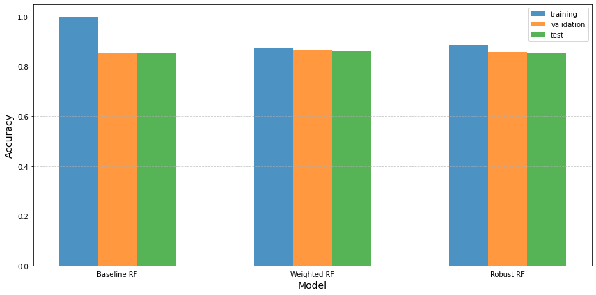
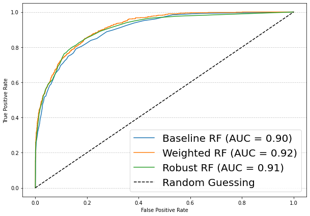

# Random forest on imbalanced dataset

## About the project

In this project, we'll explore various modifications to random forest method and how these changes modify the overall model performance. 

## Data

This dataset is about the income of an individual. It has 30162 observations and 15 features.
The goal is to predict whether annual income of an individual exceeds $50K/yr based on census data. Also known as "Census Income" dataset.

## What's included
- ```methods.py```: contains the custom methods used in this project
- ```plotter.py```: contains functions used to generate plots/metric plots
- ```setup.py```: setup file to build the Python environment.
- ```img/```: files used for the README.md and the plot included in ```implementation.ipynb```.
- ```implementation.ipynb```: tutorial notebook on usage of the code with detailed comments and results.

## How to use

### Requirements
All the dependencies needed to run the algorithms can be installed using ```setup.py```, in a pre-built ```conda``` environment. In particular, this script needs to be executed as:

```bash
python setup.py
```
You're ready to run the ```implementation.ipynb``` .

## Code details

### Methods
The three methods; baseline RF, weighted RF and robust RF are all described in the ```implementation.ipynb``` file


### Input & parameter
- ```data```: we use the data located here https://archive.ics.uci.edu/ml/machine-learning-databases/adult/adult.data
- ```class_weight```: to control the class weights e.g., {0: .6, 1: 2.1}
- ```epsilon```: controls the pertubation. by default its set to 0.1.

## Visualizations

### Model accuracy
<p align="center" width=10%>
<br>
</p>

### AUC curve
<p align="center" width=10%>
<br>
</p>

## contact

should you encounter any issue, reach out to me via abdullahiadinoyi857 [at] gmail [dot] com